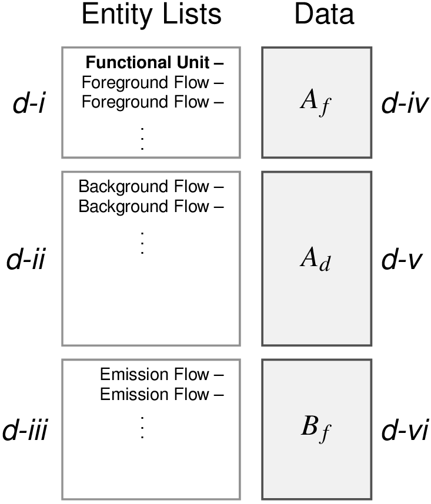

# lca_disclosures
Python based tools for working with LCA foreground model disclosures

Disclosure framework based on "Disclosure of product system models in life cycle assessment: achieving Transparency and Privacy" by Brandon Kuczenski in _J Ind Ecol_. (doi: [10.1111/jiec12810](https://doi.org/10.1111/jiec.12810))

## Supported software frameworks

The `lca_disclosures` repository supports the generation of a disclosure specification from the following software:
 
 - Brightway2
 - lcopt
 - lca-tools
  
### Usage

To use the disclosure framework, instantiate the appropriate `Disclosure` subclass and supply it with the software-specific input data.  The disclosure object can be used to answer questions about the model:
 - listing foreground flows, background flows, and emissions;
 - identifying cutoff flows (flows that exit the model boundary with no impacts);
 - performing an aggregation of the model into a unit process
 
The disclosure object can also be serialized to JSON or saved as an Excel spreadsheet.

### Requirements

 - `pandas`, to write to excel
 - `scipy` and `numpy`, to perform matrix operations

Generally, any At the moment, the disclosure class requires `brightway2` and `lcopt` to be installed in order to run tests.  However, this could probably be phased out.  

## Contents of an LCA Disclosure

A disclosure has six parts, including three lists of flows:

 - _i_ An ordered list of foreground flows, beginning with the functional unit of the system (length = _p_);
 - _ii_ An ordered list of flows from background processes or activities (length = _n_);
 - _iii_ An ordered list of environmental or social "emissions" (length = _m_).
 
And three sparse matrix specifications:

 - _iv_ A list of nonzero entries in the _p x p_ sparse matrix defining the foreground;
 - _v_ A list of nonzero entries in the _n x p_ sparse matrix defining the foreground's dependency on the background;
 - _vi_ A list of nonzero entries in the _m x p_ sparse matrix defining the foreground's direct emissions.

A visual representation of the disclosure is found in Figure 3 of the above paper:

## Development

The base Disclosure class is abstract, and a subclass must be created for each supported software type.  A subclass must populate the following methods:

 - `_prepare_efn()` returns the evaluated filename used to store disclosure serializations.
 - `_prepare_disclosure()` returns a 6-tuple corresponding to the 6 disclosure elements, in the order listed above. 
 - `__init__()` must be written to handle input data and then call the superclass `__init__`, which computes `_prepare_disclosure()` and stores the output.
